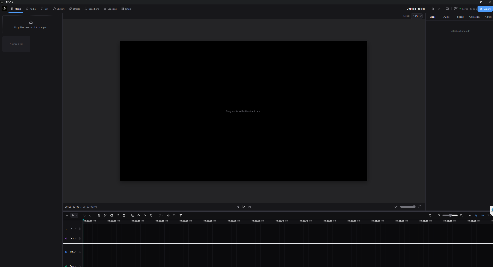
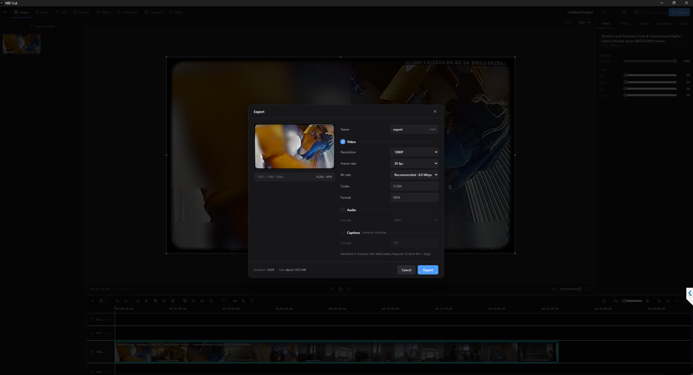

<div align="center">


# XinChao-Cut

**An open-source multi-track video editor and Voice Studio.**

[Tiếng Việt](README.md) · [Installation (Vietnamese)](docs/INSTALLATION.md) · [User guide (Vietnamese)](docs/USAGE.md)

[](LICENSE)



&nbsp;


</div>

> Open-source scope: **Editor** and **Voice Studio** only. The internal Review, Dub/Dubbing, and Batch workspaces are intentionally excluded.

XinChao-Cut can perform basic editing and export entirely in the browser. The Windows desktop app adds a local backend for FFmpeg, transcription, source separation, and speech synthesis. AI weights are **not bundled with the installer**: users choose the packages they need and whether models download during setup or on first use.

## Features

- Multi-track video, audio, text, and effects timeline with split, trim, ripple, snapping, and undo/redo.
- Direct preview manipulation, crop, rotation, speed, and color adjustments.
- SRT/VTT/ASS import and export; optional WhisperX and FunASR transcription.
- Demucs vocal/music separation.
- OmniVoice-powered Voice Studio with WAV preview/download and reusable cloned voices.
- Browser or local FFmpeg export to MP4, MP3/WAV, and subtitle formats.
- Local project/media processing; hosted LLM translation is optional and user-configured.

## Desktop quick start

The packaged desktop build currently targets 64-bit Windows 10/11.

1. Install **64-bit Python 3.11** and enable `Add python.exe to PATH`.
2. Install XinChao-Cut from [Releases](https://github.com/yudgunH/XinChao-Cut/releases).
3. Open XinChao-Cut. The initial setup wizard appears automatically on Home.
4. Select **Install Core + FFmpeg**; the backend starts automatically when setup completes.
5. Add optional AI packages later from **backend status → Model Manager**.

| Package | Purpose | Required |
|---|---|---|
| Core + FFmpeg | Media inspection, proxies, waveforms, and server export | Yes for desktop backend |
| WhisperX | Multilingual captions | No |
| FunASR | Chinese ASR with Paraformer/VAD/punctuation | No |
| Demucs | Vocal/music separation | No |
| OmniVoice | Voice Studio and voice cloning | No |

WhisperX offers `Tiny`, `Small`, and `Large v3`; `Small` is the balanced default. AI environments and weights can consume substantial disk space, so choose the data drive before downloading.

## Run from source

Node.js 20+, npm, Rust, WebView2/C++ Build Tools, and Python 3.11 are required for the full desktop development flow.

```powershell
git clone https://github.com/yudgunH/XinChao-Cut.git
cd XinChao-Cut
.\setup.bat
.\start.bat
```

`setup.bat` installs the exact Node dependencies plus the Core backend and pinned FFmpeg; it deliberately skips AI models. `start.bat` runs the hot-reload backend and launches `npm run tauri dev`. Add optional models later from **backend status → Model Manager**. See [docs/INSTALLATION.md](docs/INSTALLATION.md) for browser-only and manual development modes.

Useful checks and builds:

```powershell
npm run typecheck
npm run lint
npm test -- --run
npm run build
python -m pytest backend -q

# Desktop package
npm run backend:stage
npm run tauri build
```

The staging step copies runtime files only; tests, caches, virtual environments, model weights, and personal data are excluded.

## Repository layout

```text
src/                 React editor and Voice Studio
src-tauri/           Desktop shell and NSIS configuration
backend/app/         FastAPI, FFmpeg, and AI workers
backend/setup.ps1    Selective backend/model installer
scripts/             Build and staging tools
docs/                Design and user documentation
```

## Privacy and licenses

Local editing, export, and local AI models do not require uploading media to a XinChao-Cut service. Model downloads contact their respective distribution hosts. Subtitle translation contacts a hosted LLM only after the user configures a provider.

Project code is licensed under [MIT](LICENSE). Third-party dependencies and model weights retain their own licenses; review the relevant model card before redistribution or commercial use.

[Contributing](CONTRIBUTING.en.md) · [Security](SECURITY.en.md) · [Code of Conduct](CODE_OF_CONDUCT.en.md)
